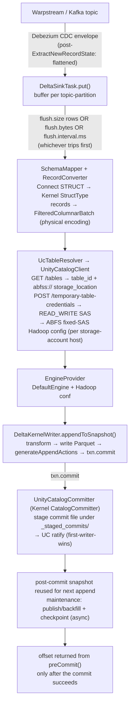

# Design spec — kafka-connect-delta-uc

`io.dakotaoss:kafka-connect-delta-uc` — a Kafka Connect sink that writes Debezium/Kafka records into
Databricks Unity Catalog **managed, catalog-managed** Delta tables via the **Delta Kernel Java API**.
No Spark.

Module: `delta-sink-connector/`. Implementation: `src/main/java/io/dakotaoss/delta/**`.

## Overview

The connector buffers `SinkRecord`s per topic-partition and commits each buffer as one Delta
transaction against a UC managed table. The write goes straight from a Connect worker JVM to ADLS via
Kernel's default (Hadoop) engine, using short-lived credentials vended by Unity Catalog, and the
commit is ratified through UC's catalog commit coordinator. There is no intermediate stage bucket and
no second compute plane — the Delta write lives in the same Connect plane as the Debezium/JDBC/HTTP
source connectors.

It is an append-only bronze writer. Kernel's write API is blind-append only, so update/delete/merge
are out of scope by construction (see Decisions). CDC DML is done downstream in Databricks.

## Goals / Non-goals

Goals:
- append Kafka records into UC **managed** Delta tables with `delta.feature.catalogManaged=supported`,
  from outside Databricks, no Spark.
- effectively-once delivery across task restarts.
- tunable commit cadence (file size / row count / max latency) so an operator can trade throughput
  against latency and small-file count.
- create the table from the Connect schema on first write when it is absent (filesystem path);
  append to a pre-created table on the catalog-managed path.
- a Delta history consistent with Spark-written tables (populated `operationMetrics` /
  `operationParameters` / `isBlindAppend`) so downstream tooling reads it the same way.

Non-goals:
- in-connector UPDATE/DELETE/MERGE. Kernel cannot do it; the connector stays bronze-only.
- partitioned writes. The writer commits one unpartitioned batch per flush. Partitioning is an
  extension point, not v0.1.
- nested-collection columns beyond STRUCT. ARRAY/MAP are rejected at schema-map time.
- cross-table atomicity. Catalog commits coordinate per table.
- owning Kafka offset storage. Connect owns offsets; the connector only gates what it returns from
  `preCommit`.

## Architecture



Per-table state (`DeltaSinkTask.TableState`) is resolved once and cached: the engine, the committer,
and — for catalog-managed tables — the snapshot, which is advanced in memory across commits rather than
reloaded from the log each time. A flush failure drops the cached state so the next flush re-resolves
(re-vends credentials, reloads the snapshot).

## The managed-UC mechanism

Writing to a Databricks **managed** UC table from an external engine is gated on two mechanisms, and
on a workspace Beta toggle.

**Catalog commits (`delta.feature.catalogManaged`).** Commit coordination moves from the filesystem to
Unity Catalog. UC is the source of truth for table state. A writer stages a commit file under
`_delta_log/_staged_commits/` and asks UC to register it at the target version. First writer wins each
version; losers get a conflict and retry. There is no cross-table atomicity. Kernel's default committer
only writes the filesystem `_delta_log` and refuses these tables — hence `UnityCatalogCommitter`.

**Credential vending.** The connector has no long-lived storage secret. It calls
`POST /api/2.1/unity-catalog/temporary-table-credentials` with `{table_id, operation: READ_WRITE}` and
gets back a short-lived token + storage URL scoped to the table. On Azure that is an
`azure_user_delegation_sas.sas_token`, installed as a Hadoop ABFS fixed SAS (see Configuration / live
findings). The calling principal needs `EXTERNAL USE SCHEMA` on the schema; the metastore needs
external data access enabled.

**Beta + runtime.** External writes to managed *Delta* tables are a Databricks **Beta**, gated behind
the workspace Previews toggle "External Access to UC Managed Delta Table". It must be enabled by a
workspace admin. Runtime must be **DBR 16.4+** to read/write/create catalog-commit tables. Managed
*Iceberg* external write via credential vending is further along than managed Delta; the format choice
is an open question for the UC team. This Beta dependency is the single largest project risk.

## Committer design

`UnityCatalogCommitter implements io.delta.kernel.commit.CatalogCommitter`. It adapts the UC Delta
commits REST API (delta-storage's `UCTokenBasedRestClient`, which wraps the UC client SDK) onto
Kernel's `Committer` contract. The lifecycle per commit:

1. **stage** — write the finalized Delta actions as a JSON file at
   `CommitMetadata.generateNewStagedCommitFilePath()` via the engine's JSON handler.
2. **ratify** — stat the staged file for size+timestamp, build `io.delta.storage.commit.Commit`, call
   `ucClient.commit(...)` at the target version. A UC `CommitFailedException` is mapped back to
   Kernel's `CommitFailedException` carrying the retryable/conflict flags so Kernel can retry.
3. **backfill / publish** — `publish(PublishMetadata)` copies ratified staged commit files to their
   numbered `NN...N.json` in the published `_delta_log`. Without this, every later snapshot read
   replays an ever-growing set of staged commits and per-commit latency climbs without bound.
   Publishing keeps reads O(1) in table history.
4. **checkpoint** — Kernel's post-commit hooks (checkpoint, checksum) keep the published log compact.

**Idempotency.** Each per-partition commit carries `SetTransaction(appId, version)` where
`appId = "<connector>:<topic>-<partition>"` and `version = last Kafka offset`. On replay after a crash,
Kernel throws `ConcurrentTransactionException` for an already-applied `(appId, version)`; the writer
treats it as a no-op. No external dedupe store.

**Snapshot reuse.** The streaming path loads the snapshot once
(`DeltaKernelWriter.loadCatalogSnapshot`) and reuses `TransactionCommitResult.getPostCommitSnapshot()`
as the base for the next append. No per-commit log re-read.

**Async maintenance.** `appendToSnapshot` does not publish or checkpoint. The task submits
`writer.maintain(...)` (publish/backfill + post-commit hooks) to a single-thread executor off the
commit path. UC already holds the ratified commit durably, so maintenance only compacts the published
log and never affects commit durability. The committer tracks `highestPublishedVersion` and passes it
as `lastKnownBackfilledVersion` on the next `ucClient.commit`, so UC stops returning commits it has
already seen published. `getCommits` results are also de-duplicated against files already present in
the published log so a backfilled version is never double-counted as log data.

**commitInfo enrichment.** Kernel's low-level writer leaves `commitInfo` sparse; Spark-written tables
populate it. The committer rewrites the commit-info action to add `operationParameters` (`mode=Append`),
`operationMetrics` (`numOutputRows` / `numFiles` / `numOutputBytes`, handed over by the writer just
before commit via `setPendingMetrics`), and `isBlindAppend=true`. Only these three are controllable:
the rest of `commitInfo` (timestamp, engineInfo, operation, txnId, in-commit timestamp) is fixed by
Kernel's `CommitMetadata` and passed through unchanged. When no metrics were supplied, the actions
pass through untouched.

## Configuration

Config surface is `DeltaSinkConfig`. Defaults shown.

| key | type | default | purpose |
|---|---|---|---|
| `databricks.workspace.url` | string | — | UC REST base URL |
| `databricks.token` | password | — | bearer token (PAT or AAD); principal needs `EXTERNAL USE SCHEMA` |
| `table.name.format` | string | `main.ingestion.${topic}` | Default template. `${topic}` = whole topic; `${topic[N]}` = its Nth dot-segment (0-indexed). Each substituted value must be a valid identifier (`[A-Za-z0-9_]`, ≤255) or routing is rejected. Must resolve to `catalog.schema.table` |
| `topic.to.table` | list | (empty) | Per-topic overrides that win over the template: `<topic>:<catalog>.<schema>.<table>,...` |
| `partition.columns` | list | (empty) | partition cols, used only when this connector creates a table |
| `flush.size` | int | 500 | rows buffered per partition before a commit; 0 disables this dial |
| `flush.bytes` | long | 0 | approx buffered bytes before a commit, for target file size (e.g. 134217728 = 128 MiB); 0 disables |
| `flush.interval.ms` | long | 5000 | max time to buffer a partition before committing |

**Three flush dials, whichever trips first.** `flush.size` and `flush.bytes` flush opportunistically
inside `put` when a buffer fills. `flush.interval.ms` is enforced by a scheduler that flushes any
non-empty buffer every interval, so queued rows commit within the interval even under light traffic.
The **5 s default for `flush.interval.ms` is the max-latency SLA** — it mirrors Zerobus and is
comfortable even from an out-of-region harness (benchmarks show ~2 s p50 commit at small batches).
Raise `flush.bytes` toward 128–256 MiB to amortize fixed per-commit cost and cut file count; that
raises latency and per-commit memory.

**Routing.** One connector handles many tables — each subscribed topic is resolved independently.
`table.name.format` is the default template: `${topic}` substitutes the whole topic and `${topic[N]}`
substitutes its Nth dot-segment (0-indexed), so a structured topic like Debezium's
`server.schema.table` maps to any `catalog.schema.table` (e.g. `bronze.${topic[1]}.${topic[3]}`)
without per-topic config. `topic.to.table` pins specific topics to arbitrary destinations and wins over
the template; unlisted topics fall back to it. The result must be a 3-part name. Concurrency:
per-partition `SetTransaction` keeps writes effectively-once even when a topic's partitions spread
across tasks; UC conflict arbitration is the safety net for same-table concurrency, not the primary
strategy. Each value substituted by `${topic}`/`${topic[N]}` must already be a valid UC identifier part
(`[A-Za-z0-9_]`, ≤255 chars); out-of-set characters are **rejected** at routing time rather than folded
to `_`. Folding was non-injective (`orders.eu`, `orders/eu`, `orders-eu` all collapsed to `orders_eu`),
so under an untrusted/pattern subscription a crafted topic could collide onto a victim's table.
Rejecting keeps the topic→table map injective; route dotted topics via `${topic[N]}` segment tokens
(the dot is the delimiter) or pin arbitrary topics with `topic.to.table` (matched on the exact topic,
never transformed).

## Delivery semantics — effectively-once

Kafka Connect sinks are at-least-once. The connector reaches **effectively-once** with two mechanisms
together:

1. `SetTransaction(appId, offset)` per partition — replays of an already-applied `(appId, version)` are
   rejected by Kernel and treated as no-ops.
2. `preCommit` returns a partition's offset **only after** that partition's Delta commit succeeds. A
   crash between buffer and commit re-delivers the batch; the `SetTransaction` stamp makes the re-commit
   a no-op.

"Effectively-once," not "exactly-once": a batch can be physically re-attempted, but the table state is
identical to a single application.

## Decisions & alternatives considered

**Delta Kernel vs delta-rs vs Spark.** Kernel (Java) is the only OSS path that does catalog-coordinated
commits, which is what makes managed-UC writes safe, and it has no Spark dependency so it embeds in a
Connect worker. Delta Spark pulls a full Spark runtime — wrong fit in a Connect JVM. delta-rs supports
DML but its deletion-vector support on managed tables is still landing and it bypasses Databricks-side
concurrency guarantees — too risky for managed tables now. Delta Standalone is superseded and does not
track catalog commits.

**Kernel 4.2 vs 4.0.** Pinned to **4.2.0**. 4.0.0 throws `Unsupported Delta table feature
"catalogManaged"` on snapshot read; CMT read support landed in 4.1.0. The write API is `@Evolving` —
the version is pinned and upgrades gate behind the test suite.

**Append-only bronze + downstream MERGE vs in-connector DML.** Bronze append, MERGE downstream in
Databricks. MERGE is a read-modify-write (find matching rows, rewrite files or write deletion vectors,
emit remove+add atomically). Kernel deliberately does not expose that, and doing it by hand from a
Connect task against object storage — correct under concurrency and DV semantics — is a query-engine
problem. Databricks MERGE is DV-aware and UC-coordinated; run it where it belongs (templates under CDC
ingestion pattern below).

**Disabling the Hadoop FS cache.** The vended SAS is scoped to each table's own directory. Hadoop
caches one `FileSystem` per storage-account host, so a second table on the same account would otherwise
reuse the first table's out-of-scope SAS and 403. `fs.abfss.impl.disable.cache=true` forces each table
to use its own vended SAS. (A per-table FileSystem would be tidier; see Known gaps.)

**Publish-every-commit vs periodic.** The all-in-one `appendCatalogManaged` publishes + checkpoints
inline every commit — correct but pays that cost on the latency path. The streaming path used in the
task instead splits it: commit synchronously, then publish/backfill + checkpoint asynchronously. UC
holds the ratified commit durably regardless, so moving maintenance off the commit path keeps
per-commit latency flat as the table grows.

## CDC ingestion pattern

Recommended source-side shape: apply the Debezium **ExtractNewRecordState** SMT to flatten the
envelope to the row image, but **retain `op` and the source sequence (LSN/SCN/commit-ts)** as columns.
The connector writes that flattened-plus-metadata row append-only into a bronze Delta table. Bronze
stays append-only — the full change log, never mutated in place.

The downstream MERGE (Lakeflow AUTO CDC, or a connector-fired `MERGE` via the Statement Execution API)
resolves current state from bronze. The source sequence is the most important field: out-of-order and
duplicate events are resolved by ordering on it (`ROW_NUMBER() OVER (PARTITION BY pk ORDER BY seq DESC)`
or AUTO CDC's `sequence_by`), never by arrival order. The MERGE's `seq > t.seq` guard makes replays
no-ops, so bronze idempotency and merge idempotency compose. Deletes propagate as `op='d'` tombstones
carrying the before-image PK. Templates: see Downstream merge templates above.

`RecordConverter`/`SchemaMapper` already recurse into nested STRUCTs, so a non-flattened envelope
(`before`/`after`/`source` as nested struct columns) also maps. Flattening is the recommended shape
because it makes the downstream MERGE simpler and the sequence/op columns first-class.

### Downstream merge templates

Two ways to turn append-only bronze into current state in Databricks.

Lakeflow AUTO CDC — declarative, resolves out-of-order via the sequence key, SCD 1/2:

```python
create_auto_cdc_flow(
    target = "main.curated.customers",
    source = "main.ingestion.customers_bronze",
    keys = ["pk"],
    sequence_by = "seq",            # source LSN/SCN/commit-ts
    apply_as_deletes = "op = 'd'",
    stored_as_scd_type = 1)
```

Connector-orchestrated MERGE via the SQL Statement Execution API — dedupe by sequence, last-write-wins:

```sql
MERGE INTO main.curated.customers t
USING (
  SELECT * FROM (
    SELECT *, ROW_NUMBER() OVER (PARTITION BY pk ORDER BY seq DESC) AS rn
    FROM main.ingestion.customers_bronze
  ) WHERE rn = 1
) s
ON t.pk = s.pk
WHEN MATCHED AND s.op = 'd'      THEN DELETE
WHEN MATCHED AND s.seq > t.seq   THEN UPDATE SET *
WHEN NOT MATCHED AND s.op <> 'd' THEN INSERT *;
```

The `seq > t.seq` guard makes replays no-ops, so bronze and merge idempotency compose.

## Live-test findings (bugs fixed)

The live run against a managed catalog-managed table drove the write path to the final commit and
flushed out bugs the offline suite cannot catch (offline uses `file://`, which never loads the ABFS
stack). All fixed in the tree.

1. **Wrong SAS provider package** — `…azurebfs.extensions.FixedSASTokenProvider` →
   `…azurebfs.services.FixedSASTokenProvider`; `extensions` holds only the interface.
2. **Wrong fixed-SAS wiring** — naming the provider type fails (`FixedSASTokenProvider` has only a
   `(String)` ctor, Hadoop's `ReflectionUtils` needs a no-arg one). Trigger the fixed-token path by
   setting **only** `fs.azure.sas.fixed.token.<host>` (+ `auth.type=SAS`); ABFS constructs the provider
   itself.
3. **Missing unshaded `commons-lang3` + `commons-io`** — `hadoop-azure` needs them but
   `hadoop-client-runtime` ships only relocated copies; added both explicitly to `pom.xml`.
4. **Missing HNS hint** — the vended SAS is table-dir-scoped; ABFS probes HNS by calling
   `getAccessControl` on the **container root** (outside scope) → 403. Set
   `fs.azure.account.hns.enabled=true` (ADLS Gen2 is always HNS) to skip the probe.
5. **Kernel version** — `4.0.0 → 4.2.0`; 4.0.0 cannot read a catalog-managed snapshot.
6. **The commit gap** — the run proved resolve → vend → ABFS write → Parquet written, but the final
   commit needed a UC `CatalogCommitter`, which Kernel's default committer is not. That gap is what
   `UnityCatalogCommitter` closes.

Side effect to clean up: a failed commit leaves an orphan uncommitted Parquet file under the table
path. Delta ignores uncommitted files; `VACUUM` removes them.

## Known gaps & future work

- **Credential refresh.** Vended SAS / AAD tokens are ~1 h. Long-running tasks need a refresh loop. Today
  a flush failure drops cached state and the next flush re-resolves (re-vends), which covers expiry
  reactively; a proactive refresh-before-expiry loop is future work. The `BearerTokenProvider` is the
  hook for token refresh.
- **Per-table FileSystem.** The FS cache is disabled globally to keep per-table vended SAS isolated. A
  per-table cache key (or per-table FS instance) would be cleaner than disabling the cache.
- **Partitioned writes.** The writer commits one unpartitioned batch per flush. Partitioning needs the
  batch grouped by partition value with a per-partition `getWriteContext` — flagged in
  `DeltaKernelWriter.append`.
- **Metrics limited to three fields.** Only `operationMetrics`/`operationParameters`/`isBlindAppend` are
  controllable in `commitInfo`; the rest is fixed by Kernel's `CommitMetadata`.
- **Schema evolution.** Additive evolution flows through; UC validates/rejects breaking changes at
  commit. Route rejected commits to DLQ/retry — not yet built.
- **Nested collections.** ARRAY/MAP columns are rejected at schema-map time.

## Risks

1. **Beta dependency (highest).** External managed-Delta writes are a Databricks Beta behind a workspace
   Preview toggle. Confirm enablement + DBR 16.4+ with the account team before committing timelines;
   track GA.
2. **`@Evolving` Kernel write API.** Writes first shipped in Delta 3.2 and remain `@Evolving` in 4.x.
   Expect API churn; the version is pinned and upgrades gate behind the test suite. The committer also
   crosses Kernel **internal** packages (`io.delta.kernel.internal.actions.*`,
   `…internal.files.*`) which are semi-public and may shift.
3. **Token lifetime.** ~1 h vended/AAD tokens; the refresh story (above) is reactive today.
4. **Delta vs Iceberg managed tables.** Managed-Iceberg external write is further along than managed
   Delta; the format decision sits with the UC team.

## Dependency security residuals

- **Shaded Avro 1.9.2 (CVE-2023-39410).** `hadoop-client-runtime` relocates Avro 1.9.2
  (`org.apache.hadoop.shaded.org.apache.avro`); CVE-2023-39410 is a denial-of-service when an Avro
  reader decodes untrusted data, fixed in Avro 1.11.3. Because the copy is shaded inside the Hadoop
  uber-jar it can't be overridden by a top-level dependency, and Hadoop 3.4.2 still ships 1.9.2 — a
  Hadoop patch bump alone does not fix it.

  *Exposure here is low.* The connector never feeds untrusted producer data to an Avro reader: Kafka
  records arrive as already-deserialized Connect `SinkRecord`s (the worker's configured converter runs
  upstream, outside this code), and the write path emits **Parquet**, not Avro. The shaded Avro is only
  reachable through Hadoop-internal code paths this connector does not drive on untrusted input. Do not
  introduce Avro deserialization of producer data in the connector while this residual stands.

  *Tracking:* watch upstream Hadoop moving Avro to 1.11.3+, then bump `hadoop.version`. Pom-level
  scanners (Dependabot, the CI Trivy SBOM scan) can't see a shaded class, so this is tracked manually;
  `.trivyignore` carries the CVE with this justification so a deeper/binary scan stays green and
  documented (re-evaluate on every Hadoop bump).

## Benchmarks

Live runs against a real managed, catalog-managed UC table (`canadacentral`), Debezium-envelope
payload, through the streaming write path (snapshot reuse + async backfill/checkpoint). Read as a floor:
the harness runs single-container cross-region, so every commit pays WAN latency a co-located worker
would not.

- **100M rows in ~7 min** (424 s, 50 commits) — **235k rows/s sustained**.
- **271k rows/s peak** at 2.5M-row batches.
- **~2 s p50 commit** at small batches — the 5 s flush cadence is comfortable, tighter in-region.
- **Latency flat at scale** — no upward trend across the 100M run's 50 commits; appends are O(1) in
  table history because publish + checkpoint run off the commit path.

Bigger batches amortize the fixed per-commit cost (snapshot load + Parquet + UC commit), trading commit
latency and file count for throughput — exposed directly via `flush.size` / `flush.bytes` /
`flush.interval.ms`. Full data + charts: [`docs/benchmarks/README.md`](benchmarks/README.md).
