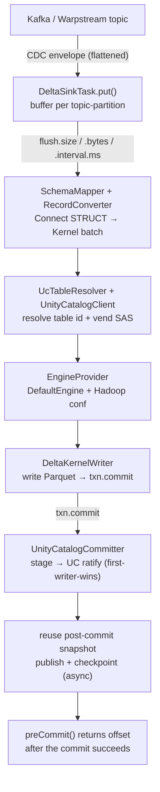

# Design spec — kafka-connect-delta-uc

`io.dakotaoss:kafka-connect-delta-uc` — a Kafka Connect sink that writes Debezium/Kafka records into
Databricks Unity Catalog **managed, catalog-managed** Delta tables via the **Delta Kernel Java API**.
No Spark.

Module: `delta-sink-connector/`. Implementation: `src/main/java/io/dakotaoss/delta/**`.

## Overview

The connector buffers `SinkRecord`s per topic-partition and commits each buffer as one Delta
transaction against a UC managed table. The write goes straight from a Connect worker JVM to ADLS via
Kernel's default (Hadoop) engine, using short-lived credentials vended by Unity Catalog, and the
commit is ratified through UC's catalog commit coordinator. There is no intermediate stage bucket and
no second compute plane — the Delta write lives in the same Connect plane as the Debezium/JDBC/HTTP
source connectors.

It is an append-only bronze writer. Kernel's write API is blind-append only, so update/delete/merge
are out of scope by construction (see Decisions). CDC DML is done downstream in Databricks.

## Goals / Non-goals

Goals:
- append Kafka records into UC **managed** Delta tables with `delta.feature.catalogManaged=supported`,
  from outside Databricks, no Spark.
- effectively-once delivery across task restarts.
- tunable commit cadence (file size / row count / max latency) so an operator can trade throughput
  against latency and small-file count.
- create the table from the Connect schema on first write when it is absent (filesystem path);
  append to a pre-created table on the catalog-managed path.
- a Delta history consistent with Spark-written tables (populated `operationMetrics` /
  `operationParameters` / `isBlindAppend`) so downstream tooling reads it the same way.

Non-goals:
- in-connector UPDATE/DELETE/MERGE. Kernel cannot do it; the connector stays bronze-only.
- partitioned writes. The writer commits one unpartitioned batch per flush. Partitioning is an
  extension point, not v0.1.
- nested-collection columns beyond STRUCT. ARRAY/MAP are rejected at schema-map time.
- cross-table atomicity. Catalog commits coordinate per table.
- owning Kafka offset storage. Connect owns offsets; the connector only gates what it returns from
  `preCommit`.

## Requirements & acceptance

Spec-driven: each requirement states the behavior and its acceptance, and links to the test(s) that
enforce it. A change starts here — update the requirement and its test, then the code, in the same PR.
Items marked *(live only)* are exercised only by the env-gated `Live*Test`; closing those
offline-coverage gaps is tracked in the linked issues.

### R1 — Effectively-once delivery
Each per-partition commit carries `SetTransaction(appId=<connector>:<topic>-<partition>, version=lastOffset)`, and `preCommit` returns a partition's offset only after its commit succeeds.
- *Accept:* re-applying the same `(appId, version)` adds no rows; offsets advance only post-commit.
- *Tests:* `DeltaKernelWriterTest.idempotentReplayDoesNotDuplicate`, `DeltaSinkTaskTest.preCommitFlushesAndReturnsNextOffset`.

### R2 — Append-only bronze
No UPDATE/DELETE/MERGE; nested STRUCT maps, while top-level ARRAY/MAP are rejected at schema-map time.
- *Accept:* an ARRAY/MAP column fails mapping; only appends are emitted.
- *Tests:* `SchemaMapperTest`, `SchemaMapperGuardTest`, `RecordConverterTest`, `RecordConverterNestedTest`.

### R3 — Injective, bounded routing
`${topic}`/`${topic[N]}` substitutes must be valid UC identifier parts (`[A-Za-z0-9_]`, ≤255) or routing is rejected (never folded); `topic.to.table` overrides win and match the exact topic; the result is 3-part.
- *Accept:* `orders-eu`/`orders.eu` are rejected (not collapsed to `orders_eu`); a >255-char part is rejected; overrides resolve verbatim.
- *Tests:* `UcTableResolverTest` — `rejectsOutOfSetCharactersInsteadOfCollapsing`, `rejectsOversizedIdentifierPart`, `explicitMapOverridesTemplateButFallsBackWhenUnmapped`, `rejectsResultThatIsNotThreePartName`.

### R4 — Credential handling
The vended SAS is held as `char[]` in `VendedSasStore` (never in the Hadoop `Configuration`) and vended per request path by `VendedSasTokenProvider`; the bearer token is a `Supplier<String>` read at the HTTP boundary; cached state re-vends proactively at `REFRESH_MS`.
- *Accept:* `abfsConfig` places no SAS in the config and wires the provider; the store vends the directory-scoped token by path (bounded per host, declining ambiguous account names); the client re-reads the token each request.
- *Tests:* `VendedSasStoreTest`, `BearerTokenProviderTest`, `UnityCatalogClientTest.buildsProviderBasedAbfsConfigAndStoresSasOutOfConfig` / `readsBearerTokenFromSupplierPerRequest`.

### R4a — Durable authentication
`databricks.auth.type` selects a `CredentialProvider`: `pat` (static token), `oauth-m2m`, or `azure-entra` (service-principal client-credentials, minted by the connector). OAuth modes refresh proactively at ~80% of token lifetime, single-flight, tolerating a transient mint failure while the cached token is still valid — so a token never expires unattended and the expired-token retry storm does not arise. Secrets never appear in logs/exceptions.
- *Accept:* refresh-before-expiry, single-flight, mint-failure tolerance, force-refresh on `invalidate()`; OAuth/Entra mint parse + non-2xx without leaking the response body; config validation per auth type.
- *Tests:* `RefreshingCredentialTest`, `OAuthMinterTest`, `DeltaSinkConfigTest` (auth-type cases + `patFactoryReturnsConfiguredToken`).

### R5 — Secret redaction
No vended SAS or bearer token reaches a log, exception message, or DLQ record.
- *Accept:* `Redact` masks whole `abfss://` URLs and SAS/bearer/`sas_token` fragments and recurses the throwable cause chain; a flush failure carrying a SAS is redacted before it reaches the DLQ reporter and the thrown exception, and `resolve()` keeps only the redacted message.
- *Tests:* `RedactTest`, `UcTableResolverTest.resolveFailureDropsRawCause`, `DeltaSinkTaskTest.flushRedactsSasBeforeThrowing` / `flushRedactsSasBeforeDlqReport`.

### R6 — Catalog-commit protocol
stage → ratify (first-writer-wins) → publish/backfill → checkpoint; `commitInfo` carries `operationMetrics`/`operationParameters`/`isBlindAppend`; an already-present checkpoint is idempotent.
- *Accept:* a commit ratifies once, publishes the numbered json, enriches commitInfo, and a re-run past a checkpoint-interval version does not fail.
- *Tests:* offline `UnityCatalogCommitterTest` (enrich / dedup / sort / backfill); the full protocol is exercised live by `Live*Test`.

### R7 — Flush cadence
`flush.size` / `flush.bytes` / `flush.interval.ms`, whichever trips first; all three disabled is a config error.
- *Accept:* the byte dial flushes before the row dial; all-off is rejected at config time.
- *Tests:* `DeltaSinkTaskTest.byteDialFlushesBeforeRowThreshold` / `opportunisticFlushWhenBufferReachesFlushSize`, `DeltaSinkConfigTest`.

### R8 — Fail-closed errors + bounded memory
Poison rows / unwritable batches go to the DLQ when a reporter is configured, else fail the task; total buffered rows are capped at `MAX_BUFFERED_RECORDS` with `RetriableException` backpressure.
- *Accept:* a poison record with no reporter fails the task; past the cap `put` throws `RetriableException`.
- *Tests:* `DeltaSinkTaskTest.schemalessRecordIsRejected`, `DeltaSinkTaskConcurrencyTest.putThrowsRetriableOncePastTheBufferedCeiling`.

### R9 — Config validation
`databricks.workspace.url` must be `https`; `topic.to.table` entries must be `<topic>:<catalog>.<schema>.<table>`; at least one flush dial must be enabled.
- *Tests:* `DeltaSinkConfigTest`.

## Architecture



(Detail per stage is in the sections below; the diagram shows the flow.)

Per-table state (`DeltaSinkTask.TableState`) is resolved once and cached: the engine, the committer,
and — for catalog-managed tables — the snapshot, which is advanced in memory across commits rather than
reloaded from the log each time. A flush failure drops the cached state so the next flush re-resolves
(re-vends credentials, reloads the snapshot). Catalog-managed state is also re-resolved proactively
before its vended SAS (~1 h TTL) can expire: `stateFor` expires a cached entry after `REFRESH_MS`
(~40 min) and re-vends, so commits never run with an expiring token.

## The managed-UC mechanism

Writing to a Databricks **managed** UC table from an external engine is gated on two mechanisms, and
on a workspace Beta toggle.

The bearer token for both the UC REST calls and the commit RPCs is sourced through a `Supplier<String>`
read on each request (`UnityCatalogClient`, `BearerTokenProvider`, `UnityCatalogCommitter`) and
materialized only at the HTTP boundary, so a re-minted token is picked up without rebuilding the client
and no extra durable copy of the secret is held.

Behind that seam sits a `CredentialProvider` (package `auth`) chosen by `databricks.auth.type`, so auth
is **set-and-forget** — once configured it never expires unattended:

- `pat` (default) — a static PAT or long-lived service-principal token in `databricks.token`,
  read per request (`StaticCredential`). Durability is the token's own lifetime.
- `oauth-m2m` — a Databricks service principal (`databricks.client.id` / `databricks.client.secret`);
  the connector mints tokens via the workspace `/oidc/v1/token` (client-credentials, scope `all-apis`).
- `azure-entra` — a Microsoft Entra service principal (`azure.tenant.id` + client id/secret) for the
  Azure Databricks resource `2ff814a6-…`; the same identity model as `az account get-access-token`.

The two OAuth modes wrap the minter in a `RefreshingCredential` that refreshes **proactively at ~80% of
token lifetime** (never below a 60 s cushion), single-flight across concurrent flush threads, and
tolerates a transient mint failure while the cached token is still valid. Because the token is refreshed
well before expiry, an expired-token 401 — and the UC-SDK retry storm it would trigger — does not arise
in steady state. One provider per task authenticates all of that task's tables.

**Catalog commits (`delta.feature.catalogManaged`).** Commit coordination moves from the filesystem to
Unity Catalog. UC is the source of truth for table state. A writer stages a commit file under
`_delta_log/_staged_commits/` and asks UC to register it at the target version. First writer wins each
version; losers get a conflict and retry. There is no cross-table atomicity. Kernel's default committer
only writes the filesystem `_delta_log` and refuses these tables — hence `UnityCatalogCommitter`.

**Credential vending.** The connector has no long-lived storage secret. It calls
`POST /api/2.1/unity-catalog/temporary-table-credentials` with `{table_id, operation: READ_WRITE}` and
gets back a short-lived token + storage URL scoped to the table. On Azure that is an
`azure_user_delegation_sas.sas_token`, held as `char[]` in a process-wide `VendedSasStore` (never placed
in the Hadoop `Configuration`) and handed to ABFS at the request boundary by a per-host
`VendedSasTokenProvider`. Because the provider disambiguates by request path, one cached FileSystem per
storage-account host serves many tables, so no JVM-global FS-cache disable is needed (see Configuration /
live findings). The calling principal needs `EXTERNAL USE SCHEMA` on the schema; the metastore needs
external data access enabled.

**Beta + runtime.** External writes to managed *Delta* tables are a Databricks **Beta**, gated behind
the workspace Previews toggle "External Access to UC Managed Delta Table". It must be enabled by a
workspace admin. Runtime must be **DBR 16.4+** to read/write/create catalog-commit tables. Managed
*Iceberg* external write via credential vending is further along than managed Delta; the format choice
is an open question for the UC team. This Beta dependency is the single largest project risk.

## Committer design

`UnityCatalogCommitter implements io.delta.kernel.commit.CatalogCommitter`. It adapts the UC Delta
commits REST API (delta-storage's `UCTokenBasedRestClient`, which wraps the UC client SDK) onto
Kernel's `Committer` contract. The lifecycle per commit:

1. **stage** — write the finalized Delta actions as a JSON file at
   `CommitMetadata.generateNewStagedCommitFilePath()` via the engine's JSON handler.
2. **ratify** — stat the staged file for size+timestamp, build `io.delta.storage.commit.Commit`, call
   `ucClient.commit(...)` at the target version. A UC `CommitFailedException` is mapped back to
   Kernel's `CommitFailedException` carrying the retryable/conflict flags so Kernel can retry.
3. **backfill / publish** — `publish(PublishMetadata)` copies ratified staged commit files to their
   numbered `NN...N.json` in the published `_delta_log`. Without this, every later snapshot read
   replays an ever-growing set of staged commits and per-commit latency climbs without bound.
   Publishing keeps reads O(1) in table history.
4. **checkpoint** — Kernel's post-commit hooks (checkpoint, checksum) keep the published log compact.

**Idempotency.** Each per-partition commit carries `SetTransaction(appId, version)` where
`appId = "<connector>:<topic>-<partition>"` and `version = last Kafka offset`. On replay after a crash,
Kernel throws `ConcurrentTransactionException` for an already-applied `(appId, version)`; the writer
treats it as a no-op. No external dedupe store.

**Snapshot reuse.** The streaming path loads the snapshot once
(`DeltaKernelWriter.loadCatalogSnapshot`) and reuses `TransactionCommitResult.getPostCommitSnapshot()`
as the base for the next append. No per-commit log re-read.

**Async maintenance.** `appendToSnapshot` does not publish or checkpoint. The task submits
`writer.maintain(...)` (publish/backfill + post-commit hooks) to a single-thread executor off the
commit path. UC already holds the ratified commit durably, so maintenance only compacts the published
log and never affects commit durability. The committer tracks `highestPublishedVersion` and passes it
as `lastKnownBackfilledVersion` on the next `ucClient.commit`, so UC stops returning commits it has
already seen published. `getCommits` results are also de-duplicated against files already present in
the published log so a backfilled version is never double-counted as log data.

**commitInfo enrichment.** Kernel's low-level writer leaves `commitInfo` sparse; Spark-written tables
populate it. The committer rewrites the commit-info action to add `operationParameters` (`mode=Append`),
`operationMetrics` (`numOutputRows` / `numFiles` / `numOutputBytes`, handed over by the writer just
before commit via `setPendingMetrics`), and `isBlindAppend=true`. Only these three are controllable:
the rest of `commitInfo` (timestamp, engineInfo, operation, txnId, in-commit timestamp) is fixed by
Kernel's `CommitMetadata` and passed through unchanged. When no metrics were supplied, the actions
pass through untouched.

## Configuration

Config surface is `DeltaSinkConfig`. Defaults shown.

| key | type | default | purpose |
|---|---|---|---|
| `databricks.workspace.url` | string | — | UC REST base URL |
| `databricks.auth.type` | string | `pat` | how to obtain the bearer token: `pat` (use `databricks.token`), `oauth-m2m` (Databricks SP client-credentials, minted+refreshed), `azure-entra` (Entra SP client-credentials for the Azure Databricks resource, minted+refreshed) |
| `databricks.token` | password | (empty) | bearer token (PAT or long-lived SP token), used when `databricks.auth.type=pat`; principal needs `EXTERNAL USE SCHEMA`. Read per request via a `Supplier<String>` so a rotated value is picked up |
| `databricks.client.id` | string | (empty) | service-principal client/application id; required for `oauth-m2m` / `azure-entra` |
| `databricks.client.secret` | password | (empty) | service-principal client secret; required for `oauth-m2m` / `azure-entra` |
| `azure.tenant.id` | string | (empty) | Microsoft Entra tenant id; required for `azure-entra` |
| `table.name.format` | string | `main.ingestion.${topic}` | Default template. `${topic}` = whole topic; `${topic[N]}` = its Nth dot-segment (0-indexed). Each substituted value must be a valid identifier (`[A-Za-z0-9_]`, ≤255) or routing is rejected. Must resolve to `catalog.schema.table` |
| `topic.to.table` | list | (empty) | Per-topic overrides that win over the template: `<topic>:<catalog>.<schema>.<table>,...` |
| `partition.columns` | list | (empty) | partition cols, used only when this connector creates a table |
| `flush.size` | int | 500 | rows buffered per partition before a commit; 0 disables this dial |
| `flush.bytes` | long | 0 | approx buffered bytes before a commit, for target file size (e.g. 134217728 = 128 MiB); 0 disables |
| `flush.interval.ms` | long | 5000 | max time to buffer a partition before committing |

**Three flush dials, whichever trips first.** `flush.size` and `flush.bytes` flush opportunistically
inside `put` when a buffer fills. `flush.interval.ms` is enforced by a scheduler that flushes any
non-empty buffer every interval, so queued rows commit within the interval even under light traffic.
The **5 s default for `flush.interval.ms` is the max-latency SLA** — it mirrors Zerobus and is
comfortable even from an out-of-region harness (benchmarks show ~1.7 s p50 commit at small batches).
Raise `flush.bytes` toward 128–256 MiB to amortize fixed per-commit cost and cut file count; that
raises latency and per-commit memory.

**Backpressure ceiling.** A hard cap of `MAX_BUFFERED_RECORDS` (~1,000,000 rows across all partitions)
bounds heap during a stalled flush (e.g. a UC outage). Past it, `put` throws a `RetriableException` so
Connect pauses and re-delivers the batch once flushes drain the buffers.

**Routing.** One connector handles many tables — each subscribed topic is resolved independently.
`table.name.format` is the default template: `${topic}` substitutes the whole topic and `${topic[N]}`
substitutes its Nth dot-segment (0-indexed), so a structured topic like Debezium's
`server.schema.table` maps to any `catalog.schema.table` (e.g. `bronze.${topic[1]}.${topic[3]}`)
without per-topic config. `topic.to.table` pins specific topics to arbitrary destinations and wins over
the template; unlisted topics fall back to it. The result must be a 3-part name. Concurrency:
per-partition `SetTransaction` keeps writes effectively-once even when a topic's partitions spread
across tasks; UC conflict arbitration is the safety net for same-table concurrency, not the primary
strategy. Each value substituted by `${topic}`/`${topic[N]}` must already be a valid UC identifier part
(`[A-Za-z0-9_]`, ≤255 chars); out-of-set characters are **rejected** at routing time rather than folded
to `_`. Folding was non-injective (`orders.eu`, `orders/eu`, `orders-eu` all collapsed to `orders_eu`),
so under an untrusted/pattern subscription a crafted topic could collide onto a victim's table.
Rejecting keeps the topic→table map injective; route dotted topics via `${topic[N]}` segment tokens
(the dot is the delimiter) or pin arbitrary topics with `topic.to.table` (matched on the exact topic,
never transformed).

## Delivery semantics — effectively-once

Kafka Connect sinks are at-least-once. The connector reaches **effectively-once** with two mechanisms
together:

1. `SetTransaction(appId, offset)` per partition — replays of an already-applied `(appId, version)` are
   rejected by Kernel and treated as no-ops.
2. `preCommit` returns a partition's offset **only after** that partition's Delta commit succeeds. A
   crash between buffer and commit re-delivers the batch; the `SetTransaction` stamp makes the re-commit
   a no-op.

"Effectively-once," not "exactly-once": a batch can be physically re-attempted, but the table state is
identical to a single application.

**Poison-record handling (fail-closed).** Each flush splits its buffer into writable rows and poison
rows (null/non-Struct value, or a schema differing from the batch's reference schema). Poison rows —
and any batch whose conversion/write fails as a whole — are routed to Connect's errant-record reporter
(DLQ) when one is configured (`errors.tolerance=all` + a DLQ topic), and the commit then advances the
offset past them. With no reporter the task fails rather than silently drop the row, so the offset
never advances over unwritten bronze data. Secrets are redacted before anything reaches the DLQ/logs.

## Decisions & alternatives considered

**Delta Kernel vs delta-rs vs Spark.** Kernel (Java) is the only OSS path that does catalog-coordinated
commits, which is what makes managed-UC writes safe, and it has no Spark dependency so it embeds in a
Connect worker. Delta Spark pulls a full Spark runtime — wrong fit in a Connect JVM. delta-rs supports
DML but its deletion-vector support on managed tables is still landing and it bypasses Databricks-side
concurrency guarantees — too risky for managed tables now. Delta Standalone is superseded and does not
track catalog commits.

**Kernel 4.2 vs 4.0.** Pinned to **4.2.0**. 4.0.0 throws `Unsupported Delta table feature
"catalogManaged"` on snapshot read; CMT read support landed in 4.1.0. The write API is `@Evolving` —
the version is pinned and upgrades gate behind the test suite.

**Append-only bronze + downstream MERGE vs in-connector DML.** Bronze append, MERGE downstream in
Databricks. MERGE is a read-modify-write (find matching rows, rewrite files or write deletion vectors,
emit remove+add atomically). Kernel deliberately does not expose that, and doing it by hand from a
Connect task against object storage — correct under concurrency and DV semantics — is a query-engine
problem. Databricks MERGE is DV-aware and UC-coordinated; run it where it belongs (templates under CDC
ingestion pattern below).

**Vended-SAS isolation without disabling the FS cache.** The vended SAS is scoped to each table's
own directory, and Hadoop caches one `FileSystem` per storage-account host — so a single cached FS for
an account would carry one table's token and 403 on a second table sharing the host. Rather than
disable the JVM-global FS cache, the connector keeps each table's SAS in a process-wide
`VendedSasStore` (held as `char[]`, never in the Hadoop `Configuration`) keyed by host + the table's
container/directory, and points ABFS at a custom `VendedSasTokenProvider`
(`fs.azure.sas.token.provider.type.<host>` + `account.auth.type=SAS`). The provider disambiguates by
the ABFS request path and hands back the directory-scoped SAS for that table, so one cached
`FileSystem` per host serves many tables. (Earlier this was done by setting
`fs.abfss.impl.disable.cache=true`; that JVM-global disable was removed in favor of the per-host
provider.)

**Publish-every-commit vs periodic.** The all-in-one `appendCatalogManaged` publishes + checkpoints
inline every commit — correct but pays that cost on the latency path. The streaming path used in the
task instead splits it: commit synchronously, then publish/backfill + checkpoint asynchronously. UC
holds the ratified commit durably regardless, so moving maintenance off the commit path keeps
per-commit latency flat as the table grows.

## CDC ingestion pattern

Recommended source-side shape: apply the Debezium **ExtractNewRecordState** SMT to flatten the
envelope to the row image, but **retain `op` and the source sequence (LSN/SCN/commit-ts)** as columns.
The connector writes that flattened-plus-metadata row append-only into a bronze Delta table. Bronze
stays append-only — the full change log, never mutated in place.

The downstream MERGE (Lakeflow AUTO CDC, or a connector-fired `MERGE` via the Statement Execution API)
resolves current state from bronze. The source sequence is the most important field: out-of-order and
duplicate events are resolved by ordering on it (`ROW_NUMBER() OVER (PARTITION BY pk ORDER BY seq DESC)`
or AUTO CDC's `sequence_by`), never by arrival order. The MERGE's `seq > t.seq` guard makes replays
no-ops, so bronze idempotency and merge idempotency compose. Deletes propagate as `op='d'` tombstones
carrying the before-image PK. Templates: see Downstream merge templates above.

`RecordConverter`/`SchemaMapper` already recurse into nested STRUCTs, so a non-flattened envelope
(`before`/`after`/`source` as nested struct columns) also maps. Flattening is the recommended shape
because it makes the downstream MERGE simpler and the sequence/op columns first-class.

### Downstream merge templates

Two ways to turn append-only bronze into current state in Databricks.

Lakeflow AUTO CDC — declarative, resolves out-of-order via the sequence key, SCD 1/2:

```python
create_auto_cdc_flow(
    target = "main.curated.customers",
    source = "main.ingestion.customers_bronze",
    keys = ["pk"],
    sequence_by = "seq",            # source LSN/SCN/commit-ts
    apply_as_deletes = "op = 'd'",
    stored_as_scd_type = 1)
```

Connector-orchestrated MERGE via the SQL Statement Execution API — dedupe by sequence, last-write-wins:

```sql
MERGE INTO main.curated.customers t
USING (
  SELECT * FROM (
    SELECT *, ROW_NUMBER() OVER (PARTITION BY pk ORDER BY seq DESC) AS rn
    FROM main.ingestion.customers_bronze
  ) WHERE rn = 1
) s
ON t.pk = s.pk
WHEN MATCHED AND s.op = 'd'      THEN DELETE
WHEN MATCHED AND s.seq > t.seq   THEN UPDATE SET *
WHEN NOT MATCHED AND s.op <> 'd' THEN INSERT *;
```

The `seq > t.seq` guard makes replays no-ops, so bronze and merge idempotency compose.

## Live-test findings (bugs fixed)

The live run against a managed catalog-managed table drove the write path to the final commit and
flushed out bugs the offline suite cannot catch (offline uses `file://`, which never loads the ABFS
stack). All fixed in the tree.

1. **Wrong SAS provider package** — early prototype used `…azurebfs.extensions.FixedSASTokenProvider`
   (the `extensions` package holds only the interface; the impl lives under `…services`). The connector
   no longer uses Hadoop's fixed-SAS provider at all (see below).
2. **Fixed-SAS wiring → per-request provider** — naming Hadoop's own provider type fails because
   `FixedSASTokenProvider` has only a `(String)` ctor and Hadoop's `ReflectionUtils` needs a no-arg one,
   and a single fixed token per host cannot serve two tables on the same storage account. The connector
   now wires a custom `VendedSasTokenProvider` per host (`fs.azure.account.auth.type.<host>=SAS` +
   `fs.azure.sas.token.provider.type.<host>=…VendedSasTokenProvider`), which has the required no-arg
   ctor and vends each table's directory-scoped SAS by request path from `VendedSasStore`.
3. **Missing unshaded `commons-lang3` + `commons-io`** — `hadoop-azure` needs them but
   `hadoop-client-runtime` ships only relocated copies; added both explicitly to `pom.xml`.
4. **Missing HNS hint** — the vended SAS is table-dir-scoped; ABFS probes HNS by calling
   `getAccessControl` on the **container root** (outside scope) → 403. Set
   `fs.azure.account.hns.enabled=true` (ADLS Gen2 is always HNS) to skip the probe.
5. **Kernel version** — `4.0.0 → 4.2.0`; 4.0.0 cannot read a catalog-managed snapshot.
6. **The commit gap** — the run proved resolve → vend → ABFS write → Parquet written, but the final
   commit needed a UC `CatalogCommitter`, which Kernel's default committer is not. That gap is what
   `UnityCatalogCommitter` closes.

Side effect to clean up: a failed commit leaves an orphan uncommitted Parquet file under the table
path. Delta ignores uncommitted files; `VACUUM` removes them.

## Known gaps & future work

- **Partitioned writes.** The writer commits one unpartitioned batch per flush. Partitioning needs the
  batch grouped by partition value with a per-partition `getWriteContext` — flagged in
  `DeltaKernelWriter.append`.
- **Metrics limited to three fields.** Only `operationMetrics`/`operationParameters`/`isBlindAppend` are
  controllable in `commitInfo`; the rest is fixed by Kernel's `CommitMetadata`.
- **Schema evolution.** Additive evolution flows through; UC validates/rejects breaking changes at
  commit. A rejected commit is routed to the DLQ by the generic fail-closed flush handler (no
  auto-evolution or retry); automatic schema-evolution / retry is not yet built.
- **Nested collections.** ARRAY/MAP columns are rejected at schema-map time.

## Risks

1. **Beta dependency (highest).** External managed-Delta writes are a Databricks Beta behind a workspace
   Preview toggle. Confirm enablement + DBR 16.4+ with the account team before committing timelines;
   track GA.
2. **`@Evolving` Kernel write API.** Writes first shipped in Delta 3.2 and remain `@Evolving` in 4.x.
   Expect API churn; the version is pinned and upgrades gate behind the test suite. The committer also
   crosses Kernel **internal** packages (`io.delta.kernel.internal.actions.*`,
   `…internal.files.*`) which are semi-public and may shift.
3. **Token lifetime (mitigated).** The vended SAS (~1 h) is re-resolved proactively at `REFRESH_MS`
   (~40 min), with a reactive drop-on-failure backstop. The bearer token comes from a
   `CredentialProvider` (R4a): `oauth-m2m`/`azure-entra` mint and refresh it proactively at ~80% of
   lifetime, and `pat` is a long-lived token — so a token does not expire unattended in steady state.
   Residual: a 401 from a genuinely-bad token (revocation / clock skew) on the commit path, where the
   fail-fast backstop is tracked in #45.
4. **Delta vs Iceberg managed tables.** Managed-Iceberg external write is further along than managed
   Delta; the format decision sits with the UC team.

## Dependency security residuals

- **Shaded Avro 1.9.2 (CVE-2023-39410).** `hadoop-client-runtime` relocates Avro 1.9.2
  (`org.apache.hadoop.shaded.org.apache.avro`); CVE-2023-39410 is a denial-of-service when an Avro
  reader decodes untrusted data, fixed in Avro 1.11.3. Because the copy is shaded inside the Hadoop
  uber-jar it can't be overridden by a top-level dependency, and Hadoop 3.4.2 still ships 1.9.2 — a
  Hadoop patch bump alone does not fix it.

  *Exposure here is low.* The connector never feeds untrusted producer data to an Avro reader: Kafka
  records arrive as already-deserialized Connect `SinkRecord`s (the worker's configured converter runs
  upstream, outside this code), and the write path emits **Parquet**, not Avro. The shaded Avro is only
  reachable through Hadoop-internal code paths this connector does not drive on untrusted input. Do not
  introduce Avro deserialization of producer data in the connector while this residual stands.

  *Tracking:* watch upstream Hadoop moving Avro to 1.11.3+, then bump `hadoop.version`. Pom-level
  scanners (Dependabot, the CI Trivy SBOM scan) can't see a shaded class, so this is tracked manually;
  `.trivyignore` carries the CVE with this justification so a deeper/binary scan stays green and
  documented (re-evaluate on every Hadoop bump).

## Benchmarks

Live runs against a real managed, catalog-managed UC table (`canadacentral`), Debezium-envelope
payload, through the streaming write path (snapshot reuse + async backfill/checkpoint). Read as a floor:
the harness runs single-container cross-region, so every commit pays WAN latency a co-located worker
would not.

- **267k rows/s peak** at 2.5M-row batches; **100M rows sustained** end-to-end.
- **~1.7 s p50 commit** at small (100k-row) batches — the 5 s flush cadence is comfortable, tighter in-region.
- **Per-commit latency flat at scale** — no upward trend across the 100M run's 100 commits (~3.5 s each);
  appends are O(1) in table history because publish + checkpoint run off the commit path.
- **8 concurrent tables in one JVM** at ~51k aggregate rows/s and **2–3% CPU** — the worker is
  WAN-latency-bound, not CPU-bound; heap (~1 GB at 8 tables), not compute, is the density ceiling.

Bigger batches amortize the fixed per-commit cost (snapshot load + Parquet + UC commit), trading commit
latency and file count for throughput — exposed directly via `flush.size` / `flush.bytes` /
`flush.interval.ms`. Full data + charts: [`docs/benchmarks/README.md`](benchmarks/README.md).
