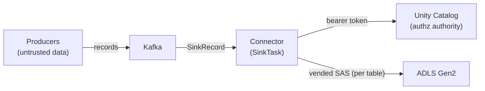

# Threat model

Scope: the connector process — a Kafka Connect `SinkTask` that reads `SinkRecord`s and writes
Databricks Unity Catalog managed, catalog-managed Delta tables via the Delta Kernel Java API. It does
not cover the Kafka cluster, the Connect runtime itself, Databricks/UC internals, or the storage
account, except where the connector trusts them. Design detail: [SPEC.md](SPEC.md).

## Trust boundaries

The connector sits between four parties, each on its own side of a boundary:

1. **Producers → Kafka → Connect.** Record values are *untrusted data*. By the time the connector sees
   them they are already-deserialized Connect `SinkRecord`s (the worker's configured converter ran
   upstream, outside this code). The connector never re-deserializes producer bytes.
2. **Connector ↔ Unity Catalog (REST).** The connector authenticates to UC with a bearer token and
   trusts UC's responses (table id, `abfss://` storage location, vended SAS, commit ratification). UC
   is the authority for what the connector may touch.
3. **Connector ↔ ADLS Gen2 (ABFS).** The connector writes Parquet and stages commit files using the
   short-lived SAS that UC vended for that table. The storage account is reached directly, not through
   Databricks compute.
4. **Connect operator → connector config.** The operator who supplies the connector config (workspace
   URL, token, routing) is trusted; config is part of the deploy, not attacker-controlled input.

## The bearer token is the only authorization boundary

There is **no long-lived storage secret** and no second access-control layer in the connector. What the
connector can write is exactly what the configured `databricks.token` principal is allowed to vend
credentials for. The principal needs `EXTERNAL USE SCHEMA` on each target schema and external data
access on the metastore; UC then vends a READ_WRITE SAS scoped to that table's storage directory.

Implications:

- **Treat the token as the keys to every reachable table.** Anyone who can read it (config store,
  process memory, a leaked log) can write any table the principal can reach.
- **Least privilege is on you.** Use a dedicated service principal granted `EXTERNAL USE SCHEMA` on
  only the schemas this connector writes — not a broad admin identity. Prefer short-lived OAuth/Entra
  tokens over a long-lived PAT.
- The token is read per request through a `Supplier<String>`, so a re-minted token is picked up without
  a restart — rotation does not require redeploying.

## Vended-SAS scoping

UC vends a SAS scoped to a single table's storage directory, READ_WRITE, ~1 h TTL. The connector keeps
it tight:

- The SAS lives as `char[]` in a process-wide `VendedSasStore`, **never** in the Hadoop
  `Configuration` (which is logged and dumped in many places).
- ABFS gets the SAS through a per-host `VendedSasTokenProvider` that disambiguates by request path and
  hands back the directory-scoped SAS for the table being written. One cached `FileSystem` per host
  serves many tables without disabling the JVM-global FS cache and without cross-table SAS bleed.
- The SAS is re-vended proactively (~40 min, before the ~1 h TTL) so a commit never runs with an
  expiring credential; a flush failure also drops and re-vends reactively.

Blast radius of a leaked SAS is one table's directory for at most its remaining TTL — materially
narrower than the bearer token.

## Untrusted producer data

Record values are untrusted. The connector's defenses:

- **No deserialization of producer bytes here.** Values arrive as Connect `SinkRecord`s; the converter
  runs upstream. The write path emits Parquet, never Avro, so the shaded-Avro CVE (below) is not on a
  path this connector drives with untrusted input.
- **Fail-closed poison-record handling.** A record with a null/non-Struct value, or a schema differing
  from the batch's reference schema, is routed to the DLQ when an errant-record reporter is configured;
  with no reporter the task fails rather than advance the offset past unwritten bronze data. A crafted
  record cannot silently skip a row.
- **Injective topic→table routing.** Topic segments substituted into `table.name.format` must already
  be valid UC identifier parts (`[A-Za-z0-9_]`, ≤255); out-of-set characters are rejected, not folded
  to `_`. Folding was non-injective (`orders.eu`, `orders/eu`, `orders-eu` all collapsed to
  `orders_eu`), so under an untrusted/pattern subscription a crafted topic name could have collided
  onto a victim's table. Rejecting keeps the map injective.

## Secret redaction

No vended SAS or bearer token may reach a log, an exception message, or a DLQ record. `Redact` masks
whole `abfss://` URLs and SAS / bearer / `sas_token` fragments; a flush failure carrying a SAS is
redacted before it reaches the DLQ reporter and before the exception is rethrown. Vulnerability reports
should still redact tokens, SAS, and storage paths from any attached logs — see [SECURITY.md](../SECURITY.md).

## Residual risks

- **Token compromise → full write access.** Inherent to the single-authz-boundary design; mitigated by
  least-privilege scoping and short-lived tokens, not eliminated. Out of the connector's control.
- **Shaded Avro 1.9.2 (CVE-2023-39410).** `hadoop-client-runtime` relocates Avro 1.9.2; the CVE is a
  DoS when an Avro reader decodes untrusted data. Exposure is low — the connector never feeds producer
  data to an Avro reader (Parquet-only write path, deserialization upstream). It can't be overridden by
  a top-level dependency because the copy is shaded; tracked manually in `.trivyignore` until upstream
  Hadoop moves to Avro 1.11.3+. Do not introduce Avro deserialization of producer data while this
  stands. Detail: [SPEC.md — Dependency security residuals](SPEC.md#dependency-security-residuals).
- **Beta / `@Evolving` API surface.** The managed-UC write depends on a Databricks Beta and the
  `@Evolving` Kernel write API (it crosses some Kernel-internal packages); behavior can shift on
  upgrade. Versions are pinned and upgrades gate behind the test suite.
- **Trust in UC responses.** The connector trusts the storage location and SAS UC returns; a
  compromised UC/metastore could redirect writes. This is outside the connector's boundary — UC is the
  authority by design.
- **Config/secret-store handling.** The token's at-rest protection (Connect config provider, secret
  store, file permissions) is the operator's responsibility; the connector only ensures it isn't leaked
  at runtime.
