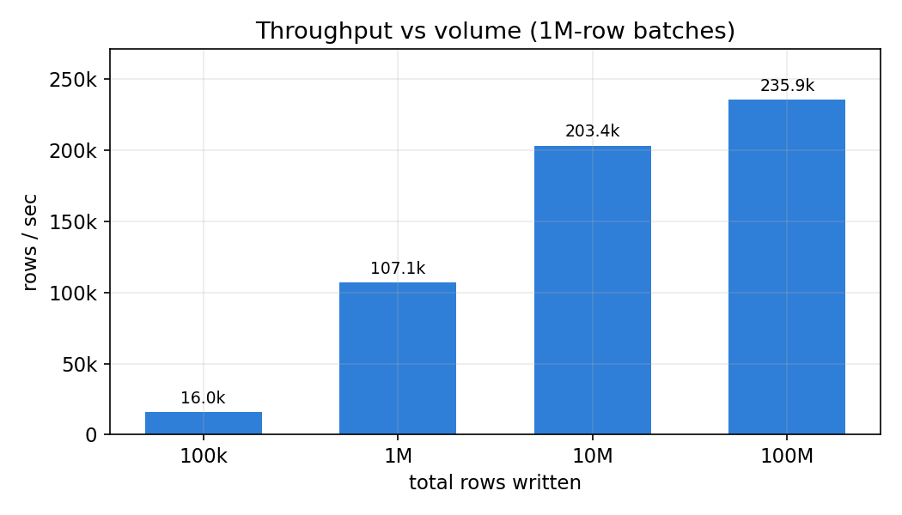
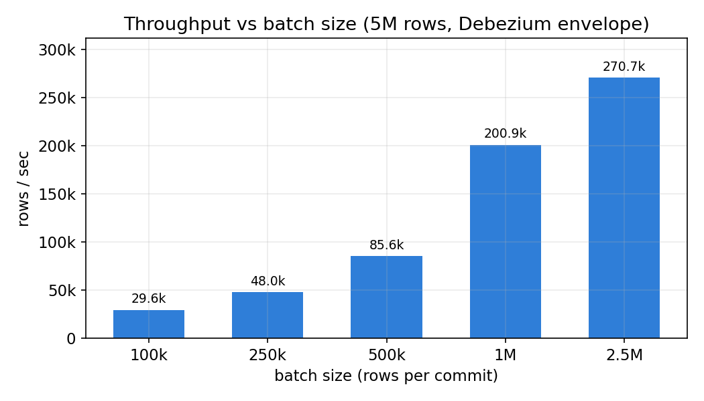
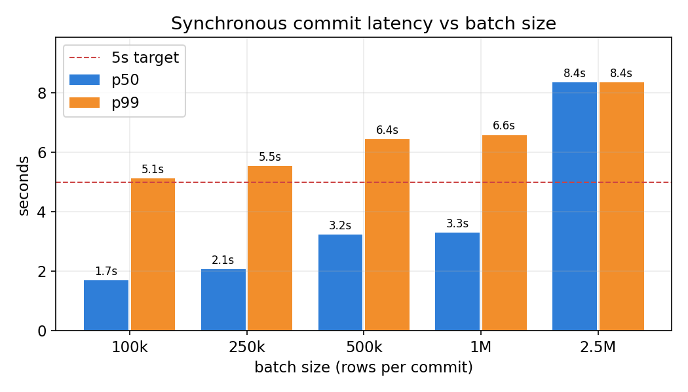
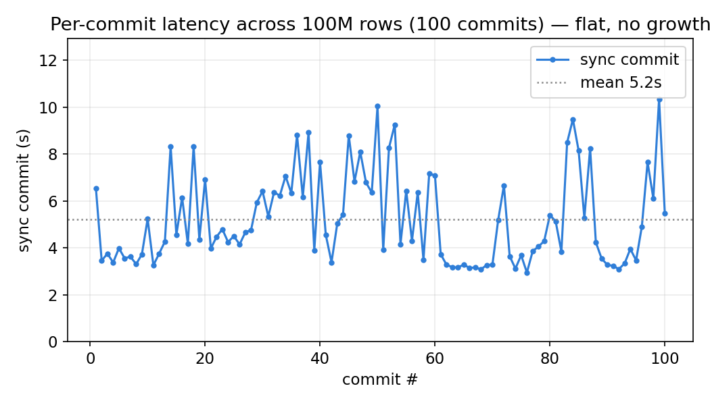
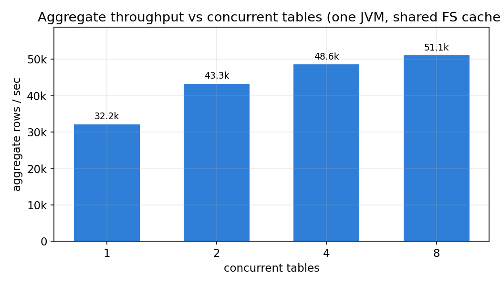
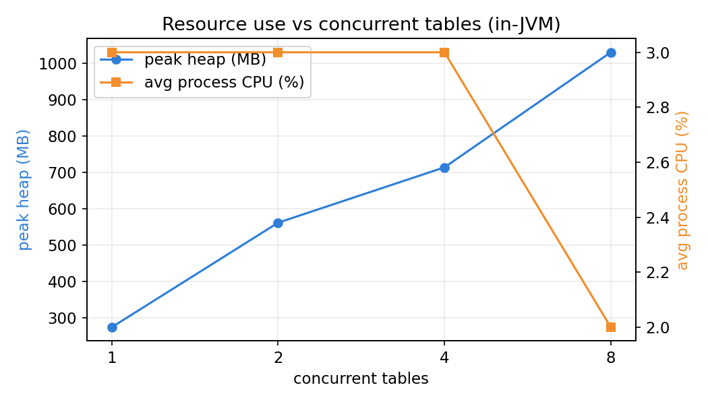

# Benchmark results

Live runs against a real Databricks **managed, catalog-managed** Delta table (Unity Catalog,
`canadacentral`), writing a realistic **Debezium envelope** payload — nested `before`/`after`/`source`
structs — through the connector's streaming write path (snapshot reuse + asynchronous
backfill/checkpoint).

> **Read these as a floor, not a ceiling.** The harness runs in a single local Docker container
> talking cross-region to ADLS + Unity Catalog, so every commit pays WAN round-trip latency; a Kafka
> Connect worker co-located with the workspace region removes most of it. Synthetic rows draw from
> ~10k distinct entities, so on-disk files compress better than production-cardinality data would.

## Highlights

- **267k rows/s peak** at large (2.5M-row) batches — to a managed, catalog-managed UC table, no Spark.
- **~1.7 s p50 commit latency** at small (100k-row) batches — a 5 s max-latency flush cadence is
  comfortable even from this out-of-region harness, and tighter in-region.
- **Per-commit latency stays flat at scale** — across all 100 commits of the 100M-row run there is no
  upward trend (~3.5 s each); appends are O(1) in table history thanks to off-path backfill + periodic
  checkpoints.
- **100M rows sustained** end-to-end; aggregate throughput rises with batch size as the fixed
  per-commit cost (snapshot load + Parquet + UC-coordinated commit) is amortized.

## Scaling

Throughput climbs as larger batches amortize fixed commit cost; at a fixed 1M-row batch it sustains a
160–230k rows/s band out to 100M rows. (The 100M aggregate also carries the end-of-run drain of ~100
async backfill/checkpoint tasks — work a long-running worker overlaps continuously rather than paying
at the end — so per-commit latency, below, is the cleaner steady-state signal.)



## Batching: throughput vs. latency vs. file size

Bigger batches amortize the fixed per-commit cost (snapshot load + Parquet + UC-coordinated commit),
trading commit latency and file count for throughput. The connector exposes this directly via
`flush.size` (rows), `flush.bytes` (target file size), and `flush.interval.ms` (max latency) —
whichever trips first.





## Latency holds flat at scale

Per-commit synchronous latency over the full 100M-row run — no growth as the table accumulates 100
versions (publish + checkpoint run off the commit path).



<details>
<summary><b>Full data</b></summary>

**Batch-size sweep (5M rows), one fresh table per point:**

| batch (rows) | rows/sec | commits | p50 commit | p99 commit |
|---:|---:|---:|---:|---:|
| 100,000 | 29,999 | 50 | 1.70 s | 5.12 s |
| 250,000 | 91,623 | 20 | 2.07 s | 5.54 s |
| 500,000 | 122,219 | 10 | 3.23 s | 6.44 s |
| 1,000,000 | 225,566 | 5 | 3.30 s | 6.58 s |
| 2,500,000 | 267,004 | 2 | 8.36 s | 8.36 s |

**Volume scaling (1M-row batches), one fresh table per point:**

| rows | rows/sec | commits |
|---:|---:|---:|
| 1,000,000 | 92,254 | 1 |
| 10,000,000 | 227,747 | 10 |
| 100,000,000 | 161,050 | 100 |

_(100M aggregate includes the end-of-run async-maintenance drain; see the flat per-commit timeline above.)_

</details>

## Concurrent tables in one worker

A single Connect task usually fans out across many topic-partitions / tables. Here one JVM writes to
N catalog-managed tables at once (each its own envelope stream), sharing one filesystem cache and one
flush path. Aggregate throughput climbs as tables are added — concurrent commits overlap each other's
WAN round-trips — while **per-table** throughput falls, because the per-partition flush is serialized
under a single lock (the head-of-line cost this connector pays for strict per-partition commit order).





| concurrent tables | aggregate rows/s | per-table rows/s | p50 commit | p99 commit | peak heap | avg CPU |
|---:|---:|---:|---:|---:|---:|---:|
| 1 | 32,152 | 32,152 | 1.65 s | 5.20 s | 275 MB | 3% |
| 2 | 43,287 | 21,643 | 1.65 s | 5.39 s | 562 MB | 3% |
| 4 | 48,578 | 12,144 | 1.72 s | 5.75 s | 714 MB | 3% |
| 8 | 51,113 | 6,389 | 1.87 s | 5.81 s | 1,030 MB | 2% |

The headline is the **CPU column: 2–3% average** (peak 42–86% on brief commit bursts). The worker is
**WAN-latency-bound, not CPU-bound** — it spends nearly all its time waiting on cross-region ADLS +
UC round-trips, not computing. Heap scales roughly linearly with table count (per-table snapshot
state and Parquet buffers), so density, not CPU, is the ceiling on tables-per-worker. Two consequences: (1)
in-region deployment, where round-trips are ~1 ms instead of ~50 ms, should multiply these numbers;
(2) the formerly-serialized flush now commits independent tables in parallel — set `flush.concurrency`
above 1 (default 1) to overlap their WAN round-trips, since the idle CPU has the headroom.

## JVM vs. Rust (delta-rs): would a rewrite be faster?

A planned sister project writes the same connector in Rust (on [delta-rs](https://github.com/delta-io/delta-rs))
to benchmark against this one. Grounding the prediction in the data above:

- **Throughput: likely a wash.** At 2–3% CPU the bottleneck is WAN round-trip latency to ADLS and the
  UC commit coordinator, not compute or GC. Rust can't make the network faster, so per-commit latency
  — and therefore throughput at a given batch size — should land within noise of the JVM. Whoever
  pipelines commits more aggressively (overlapping in-flight commits) wins here, and that's an
  architecture choice, not a language one.
- **Memory: Rust wins, clearly.** This connector's heap runs 275 MB → ~1 GB across 1→8 tables. A
  delta-rs writer (Rust + Arrow, no JVM, no managed heap) would do the same work in tens of MB. For a
  high-fanout worker or a serverless/sidecar deployment, that density gap is the most material
  difference.
- **Tail latency: Rust wins modestly.** Part of the JVM's p99 (≈5 s vs p50 ≈1.7 s) is WAN variance,
  but some is GC and JIT warmup. No managed heap means no GC pauses and a flat cold start — worth more
  to a latency-SLO sidecar than to a throughput-oriented sink.
- **Cold start / density: Rust wins.** No JIT warmup, sub-second start, small static binary — better
  for scale-to-zero and packing many writers per host.
- **Ecosystem fit: the JVM wins, and it's not close for *this* deployment.** Kafka Connect is
  JVM-native, so this connector runs **in-process** in the worker — no extra hop, no serialization
  boundary. Delta Kernel Java is the reference implementation of the protocol, and the UC
  commit-coordinator client (the catalog-managed write path this connector depends on) is a
  first-class JVM library. delta-rs is mature for plain Delta read/write, but the **catalog-managed /
  UC-coordinated commit** path is newer ground in Rust.

A Rust sink would reach Kafka Connect one of three ways, in rising order of integration cost: a
**standalone consumer** (its own Kafka consumer loop — simplest, but outside Connect's offset/rebalance
machinery); an **HTTP sidecar behind Connect** (a thin JVM sink SMT/connector POSTs batches to a
local Rust writer — keeps Connect semantics, adds a localhost serialization hop); or **in-process via
JNI/FFI** (lowest latency, highest fragility). The HTTP sidecar is the pragmatic middle: it keeps
Connect's rebalance/offset handling while getting Rust's memory and cold-start profile for the actual
Delta+UC write.

**Bottom line:** for this WAN-bound, append-only workload, expect **throughput parity** with Rust
winning on **memory footprint, tail latency, and cold start**, and the JVM winning on **ecosystem
fit** (in-process Connect + reference Kernel + UC client). The interesting wins on either side come
from pipelining commits and moving in-region — not from the language.

## Reproduce

Only **Docker** is required — no local Java or Maven. Create the bench table
([`bench-table.sql`](bench-table.sql)) in Databricks, set credentials, and run:

```bash
export DATABRICKS_HOST="https://adb-xxxx.azuredatabricks.net"
export DATABRICKS_TOKEN=$(az account get-access-token --resource 2ff814a6-3304-4ab8-85cb-cd0e6f879c1d --query accessToken -o tsv)
export BENCH_TABLE="main.default.bench_cdc"
export BENCH_ROWS=10000000 BENCH_BATCH=1000000
./run-benchmark.sh          # Windows: ./run-benchmark.ps1
```

It runs `BenchmarkTest` in a `maven:3.9-eclipse-temurin-17` container against the connector module and
prints per-commit + summary `[BENCH-RESULT]` lines. Regenerate the charts from the CSVs with
`uv run --with matplotlib --with numpy python make_charts.py`.

### Durable multi-point sweep

`run-benchmark` does one point against a table you pre-create. The tables above came from a *sweep* —
many points back to back — and at that length three failure modes turn silent: a token expiring
mid-run becomes a retry storm that looks like a hang; reusing one table lets a partially-committed
point desync the UC commit coordinator so the next point storms too; and buffered output leaves you
blind to progress. [`run-sweep.sh`](run-sweep.sh) (Windows: [`run-sweep.ps1`](run-sweep.ps1)) closes
all three — a **fresh, uniquely-named table per point** (dropped after), an optional **token re-mint
before every point**, **live** per-commit streaming to a per-point log, and a **per-point timeout**
that kills a storming point loudly and moves on (any failure → non-zero exit). It needs a SQL
warehouse to create/drop the tables:

```bash
export DATABRICKS_HOST="https://adb-xxxx.azuredatabricks.net"
export BENCH_WAREHOUSE_ID="<sql-warehouse-id>"
# re-minted before each point so a long sweep never carries an about-to-expire token:
export BENCH_MINT_CMD='az account get-access-token --resource 2ff814a6-3304-4ab8-85cb-cd0e6f879c1d --query accessToken -o tsv'
export BENCH_BATCHES="100000 250000 500000 1000000 2500000" BENCH_SWEEP_ROWS=5000000
./run-sweep.sh              # appends batch-sweep.csv; logs under sweep-logs/
```

_Raw data: [`batch-sweep.csv`](batch-sweep.csv), [`volume-scaling.csv`](volume-scaling.csv),
[`latency-timeline-100m.csv`](latency-timeline-100m.csv)._
