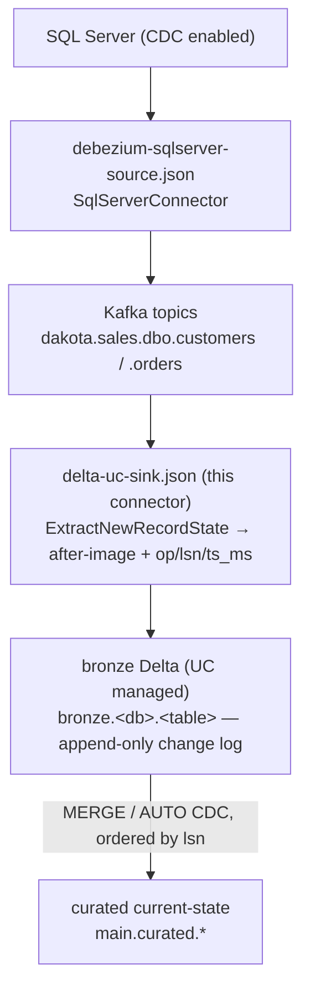

# Examples — Debezium → Delta CDC pipeline

End-to-end CDC: SQL Server → Debezium → Kafka → this sink → append-only bronze Delta in Unity
Catalog → downstream MERGE for current state. Two connector configs run on the same Connect worker.



Bronze is the full change log, never mutated in place. The sink is append-only (the Kernel write API has
no DML); deletes and updates land as rows and are resolved downstream. See
[../docs/SPEC.md](../docs/SPEC.md) for the commit protocol and merge templates.

## Files

- `debezium-sqlserver-source.json` — Debezium SQL Server source. Emits one topic per captured table,
  named `<topic.prefix>.<database>.<schema>.<table>` (here `dakota.sales.dbo.customers`, `dakota.sales.dbo.orders`).
- `delta-uc-sink.json` — this connector, consuming those topics. `ExtractNewRecordState` flattens the
  envelope; routing maps each topic to a bronze table; the three flush dials set the commit cadence.

## The SMT and the columns it keeps

`transforms.unwrap.add.fields=op,source.lsn,source.ts_ms` flattens the envelope to the after-image and
re-adds three metadata fields. Debezium prefixes added fields with `__`, so the flattened value carries:

- `__op` — `c`/`u`/`d`/`r`
- `__source_lsn` — the SQL Server LSN, i.e. the **monotonic source sequence**
- `__source_ts_ms` — the source commit time

`delete.handling.mode=rewrite` turns deletes into a normal row with `__deleted=true` (and `__op=d`)
instead of a null value, so tombstones reach bronze as rows. `drop.tombstones=false` keeps the Kafka
tombstone too.

Keep `__op` plus a monotonic sequence (`__source_lsn`) on every bronze row — the downstream MERGE orders
and dedupes on the sequence, not on arrival order. Without it you cannot resolve out-of-order or
duplicate events.

## Routing topics to tables

There are two ways to map a topic to a `catalog.schema.table`, and you can mix them.

**Template** (`table.name.format`) derives the destination from the topic's dot-segments, so one rule
covers many topics. The example uses `bronze.${topic[1]}.${topic[3]}`, so topic
`dakota.sales.dbo.customers` (segments `dakota`/`sales`/`dbo`/`customers`, 0-indexed) routes to
`bronze.sales.customers`, and `dakota.sales.dbo.orders` to `bronze.sales.orders` — no per-topic config.

**Explicit overrides** (`topic.to.table`) pin specific topics to arbitrary destinations, and a match
wins over the template. The value is comma-separated `<topic>:<catalog>.<schema>.<table>` entries:

```json
"topic.to.table": "dakota.sales.dbo.customers:bronze.sales.customers,dakota.sales.dbo.orders:main.cdc.orders_raw"
```

Here `customers` lands in `bronze.sales.customers` (same as the template) while `orders` is pinned to a
different destination, `main.cdc.orders_raw`. Every resolved name must be a valid three-part
`catalog.schema.table`. Routing requires the **External Access to UC Managed Delta Table** Beta and
DBR 16.4+ (see [../README.md](../README.md#status)).

## Bronze table (create once, per topic)

The catalog-managed sink appends to a pre-created table — auto-creating the catalog-managed table on
first write is planned but not yet implemented, so create it first. The schema must match the flattened
value, with all columns nullable (Kernel enforces nullability):

```sql
CREATE TABLE bronze.sales.customers (
  id INT, name STRING, email STRING,
  __op STRING, __source_lsn STRING, __source_ts_ms LONG, __deleted STRING
) TBLPROPERTIES ('delta.feature.catalogManaged' = 'supported');
```

## Prerequisites

- The connector jar on the Connect worker plugin path. Build it from `delta-sink-connector/`:
  ```
  docker run --rm -v "$PWD/delta-sink-connector:/work" -w /work maven:3.9-eclipse-temurin-17 mvn -B package
  ```
- The Debezium SQL Server connector on the same worker.
- SQL Server with CDC enabled on the captured tables (`sys.sp_cdc_enable_table`), and an agent that can
  read the CDC tables.
- A Databricks workspace with the External Access to UC Managed Delta Table Beta enabled, DBR 16.4+, the
  token principal granted `EXTERNAL USE SCHEMA` on the target schema, and the bronze tables created (above).
- Secrets externalised via the worker's config provider. Both configs read
  `${file:/opt/secrets/*.properties:key}`; wire `FileConfigProvider` (or your provider) on the worker.

## Post the configs

Source first (so the topics exist), then the sink:

```
curl -s -XPOST -H 'Content-Type: application/json' \
  http://localhost:8083/connectors -d @debezium-sqlserver-source.json

curl -s -XPOST -H 'Content-Type: application/json' \
  http://localhost:8083/connectors -d @delta-uc-sink.json
```

Check status:

```
curl -s http://localhost:8083/connectors/delta-sink-cdc/status
```

## Downstream MERGE

Bronze → current state in Databricks, ordered by `__source_lsn`. Last-write-wins, with deletes applied:

```sql
MERGE INTO main.curated.customers t
USING (
  SELECT * FROM (
    SELECT *, ROW_NUMBER() OVER (PARTITION BY id ORDER BY __source_lsn DESC) AS rn
    FROM bronze.sales.customers
  ) WHERE rn = 1
) s
ON t.id = s.id
WHEN MATCHED AND s.__op = 'd'                THEN DELETE
WHEN MATCHED AND s.__source_lsn > t.__source_lsn THEN UPDATE SET *
WHEN NOT MATCHED AND s.__op <> 'd'           THEN INSERT *;
```

The `__source_lsn >` guard makes replays no-ops, so bronze idempotency and merge idempotency compose. A
declarative alternative (Lakeflow AUTO CDC, `sequence_by = __source_lsn`) is in
[../docs/SPEC.md](../docs/SPEC.md#downstream-merge-templates).
